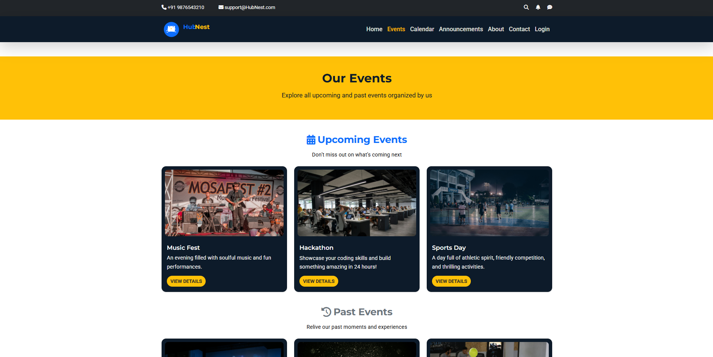
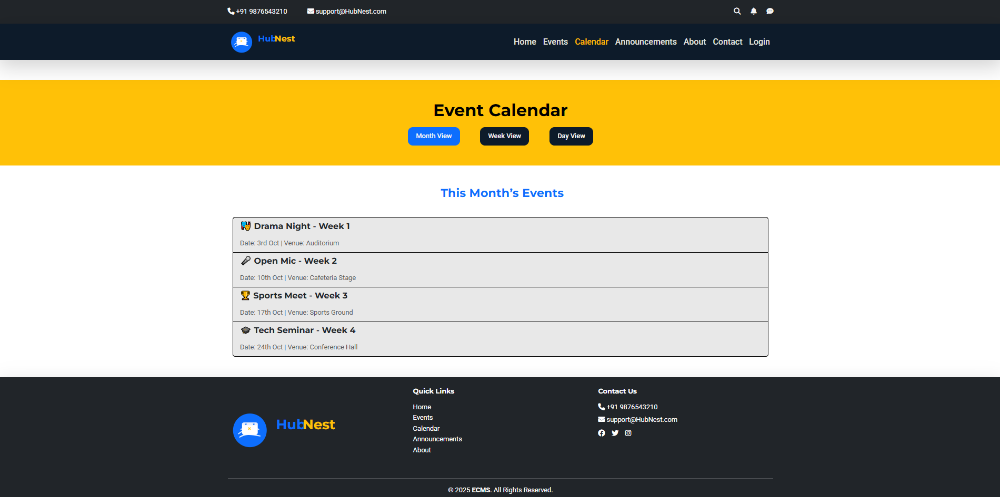
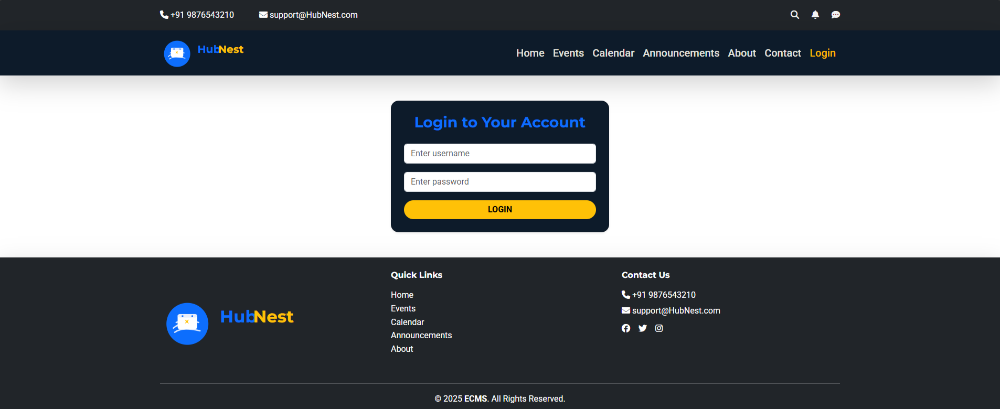
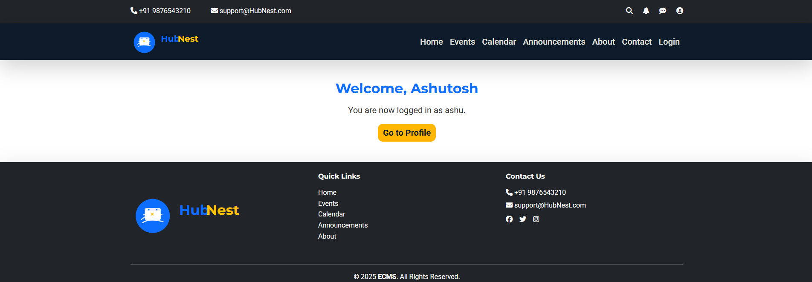
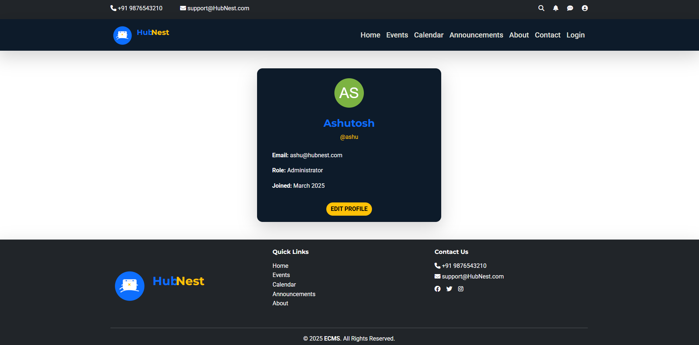

# 🎉 Event Management System (React.js)

## 📌 Overview

A UI-focused Event Management System built using React.js. This project allows users to explore events, view detailed information, check schedules via a calendar, and log in to access a personalized dashboard and profile.

---

## 🚀 Features

* 🏠 Home Page
* 📅 Events Page (Upcoming & Past Filtering)
* 🔍 Event Details (Dynamic Routing using useParams)
* 🗓 Calendar (Month / Week / Day views using Nested Routing)
* 🔐 Login System (Static Authentication)
* 👤 Dashboard & Profile Page

---

## 🧠 Concepts Used

* React Functional Components
* React Hooks (`useState`, `useParams`, `useNavigate`)
* Props Drilling
* Conditional Rendering
* Array Filtering & Mapping
* Nested Routing (React Router DOM)

---

## 🛠 Tech Stack

* React.js
* React Router DOM
* Bootstrap
* JavaScript (ES6)

---

## 📸 Screenshots

### 🖥 Desktop View

#### Home Page


#### Events Page




#### Calendar



#### Login



#### Dashboard



#### Profile



---

### 📱 Mobile View

#### Home


#### Events


---

## ⚙️ Installation & Setup

```bash
npm install
npm run dev
```

---

## 📌 Future Improvements

* Add backend (Node.js + MongoDB)
* Replace static login with real authentication
* Use Context API to avoid props drilling
* Add event booking functionality

---

## 👨‍💻 Author

Ashutosh
GitHub: https://github.com/coded-by-ashutosh
